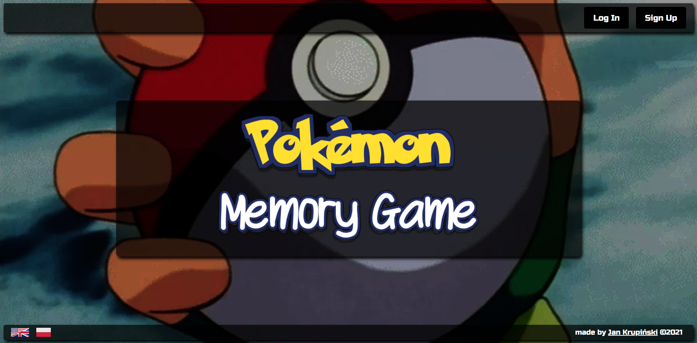

# Pokemon Memory Game
Memory Game based in pokemon world

## Installation
Download or clone repository

Add .env file with custom Firebase api keys
```
API_KEY=...
AUTH_DOMAIN=...
DATABASE_URL=...
PROJECT_ID=...
STORAGE_BUCKET=...
MESSAGING_SENDER_ID=...
APP_ID=...
```

Run
```bash
# installing dependances
$ npm install

# building css styles based on tailwind
$ npm run build-css
```

## Running the app
```bash
# development
$ npm run build

# watch mode
$ npm run dev
```

## Homepage view
